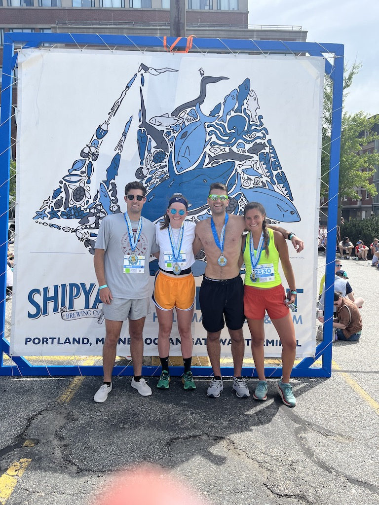
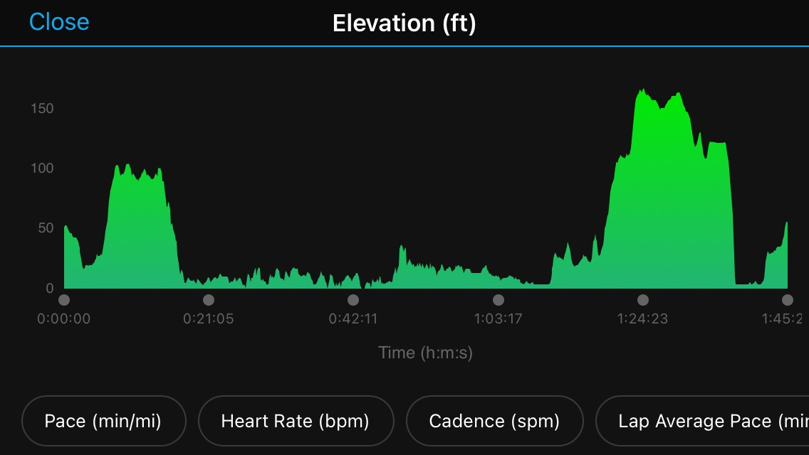
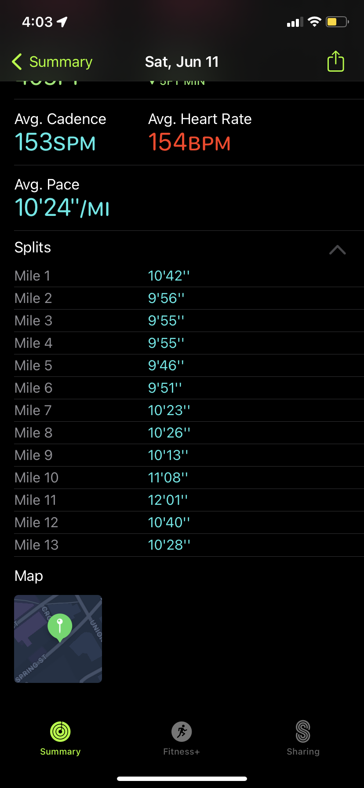

## Acknowledgements

To Ellie, Sarah, Matt, Simone, Mom, Dad, and anyone along the way that encouraged me. Thank you for your support and guidance! I’ve learned so much about running, lifting, stretching, and myself while doing this. I didn’t think I’d learn this much while doing something I’ve technically already done before!

## Old Port Half Marathon - 2:15:47

My primary goal for this half marathon was to run a half marathon in under two hours.

I loved this race and doing it with Matt, Sarah, and Ellie. The entire day was a lot of fun, and we met up with our friend Craig who lives in Portland after the race. I did NOT like the hills towards the end of the race. My pace was really good up until around mile 10 when we had to run up a giant hill.

The hills destroyed me, but I was able to get my heart rate down in the downhills by taking longer strides to catch my breath so I had another little burst of speed right at the end. I think I needed to take it easier in the first half of the race because I was keeping with a ~10:00 minute per mile pace for the first half and that dropped after the halfway point to about a ~10:30 minute per mile pace. We didn’t know the course, and all of us agreed that we would be much more conservative in the first half of the race if we knew how tough the hills would be at the end.

## How'd I do?

So, I didn’t reach my goal of under 2 hours. But, I consider this a successful race. I knocked 12 minutes off my previous half marathon time and didn’t walk the entire race (other than to throw back some water instead of choking on it). However, I consider this a win. I learned so much and found that I enjoyed running for the first time in my life. I’m extremely happy with all my progress and I feel great - lifting is much easier now that my cardio isn’t absolute garbage, and it is now much easier to throw on my shoes and get a quick run in!

## The Training

This started when Sarah said she was interested in doing another half marathon. I had been running here and there, going sporadically without a plan or a goal. I wasn't too fond of running and I thought “why the heck not”. After I asked Ellie for a plan to make sure I could run the race, we made a Run Gang group chat with Sarah, Ellie, and me where we talked about our runs and shared progress. We eventually brought Matt into the Run Gang when he decided to run the half as well!

I cannot stress how much that group chat helped me. It kept me grounded and motivated after a shitty run, and it jacked me up after victories.

This was the first time I had followed a plan with a group of people and a coach (Coach Ellie!!!). I’m used to picking a plan and following it entirely myself, with little discussion about what I’m doing with anyone else and no one to keep me accountable when I’m not feeling motivated. I know I’ve tried to subtly get insight from other people, but I’ve never had a whole group of people I can reach out to or someone with significantly more knowledge than me on a subject coaching me while training. I loved it!

Another new thing during the training for this half was doing runs with a group of people. We ran an 8-mile run with the Run Gang, and even though I went super slow I ended up talking to Coach Ellie about everything under the sun. Some of the most comfortable and memorable runs I’ve had were 12+ min per mile pace runs with Ellie chatting about everything. I liked these runs and want to do more of these runs with anyone that will do them with me.

I learned that I really shouldn’t be pushing the lifting and the running at the same time because then I’ll end up sleeping 10 hours a night and still taking an hour-long nap during the day. Lifting heavy ***OR*** running hard - both are unmaintainable *right now*. I’m hoping that as I improve my work capacity, I can fit both the lifting and the running in and get closer to both of those goals. Early on in the plan, I found it hard to adhere to the schedule. As time progressed, I felt that it was getting easier to adhere to the schedule for running, but lifting was taking a backseat. I also found that the long runs would destroy my knees, and while I felt mentally fine, my knees would hurt for a good few days. I also felt like my calves were tight, but long stretching usually cleared that up. These got *MUCH* better after I got a new pair of shoes. Shout out to the [Runner's Alley](https://stores.runnersalley.com/portsmouth) for Nuun tablets, Gu, shoes, and sunglasses!

I was pretty frustrated that I couldn’t fit lifting and running in as frequently as I wanted to. I ended up reaching out to Simone, who gave me incredibly detailed responses on her theory and approach to lifting and running. Simone ran in the 2022 Boston Marathon and worked out twice a day for the entire training cycle. I found out that through our discussion, I am likely overanalyzing my workout plan and that it is OK that lifting takes a backseat while training for a half. I reevaluated my lifting plan and organized it differently so that I focused more on exercises that would complement my runs, while still making sure to hit the compounds to keep some level of muscle (chin-ups, bench, squat, deadlift, OHP, lunges, core). This helped me refocus my lifting, something I had been neglecting.

## What am I taking away from this experience?

To me, this was so much more than just running a half marathon. I learned that there are so many people around me who can answer questions I have, I just have to ask the question. I’m hoping to keep asking questions and learning from more and more people around me 😊. But a special thank you to Ellie, Matt, and Sarah - you guys were the first and I appreciate your encouragement more than you know.

## What’s next?

In the next few weeks, I’ll be running a 4-mile race and the B.A.A 10k. For my next training, I’m going to be training for speed next! I’d like to get back into the gym, so I’m going to be training for a 5k and also running a 12-week lifting program. I know I can run a 5k, so I’ll be focusing on speed, pacing, and trying to get my time down. There is also a half in November that the gang is thinking about doing in Delaware, so that might also be coming soon.
