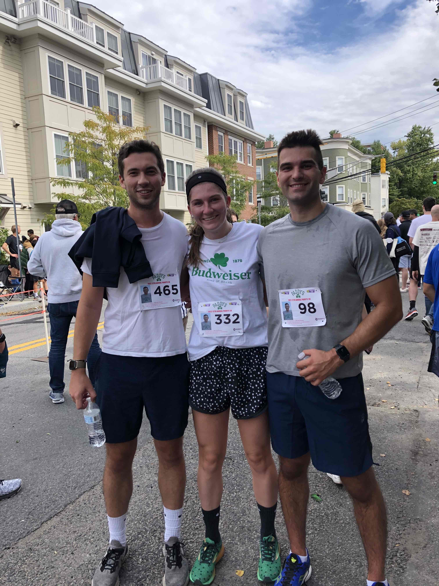

## Race Recap

During this race, I started out incredibly strong. I ran the first mile at around a 6 minute per mile pace as I weaved in and out of people. We started behind a good majority of the people and the starting line wasn't made for that many people.

I ended up running a 7:29 minute per mile 5k. This was definitely towards my upper limit at the time - my stomach was all over the place after the race, likely due to caffeine and food eaten before the race.

This was the first race I've done as a group of friends that I've "won!" Going to CRC has been incredible for my speed and performance on race day.

## What next?

For now, I like training with no plan. I really like the 5k race distance honestly because it is right around the distance for a soccer game. My goal is to run a 20 minute 5k and then continue to push it down further and further.

