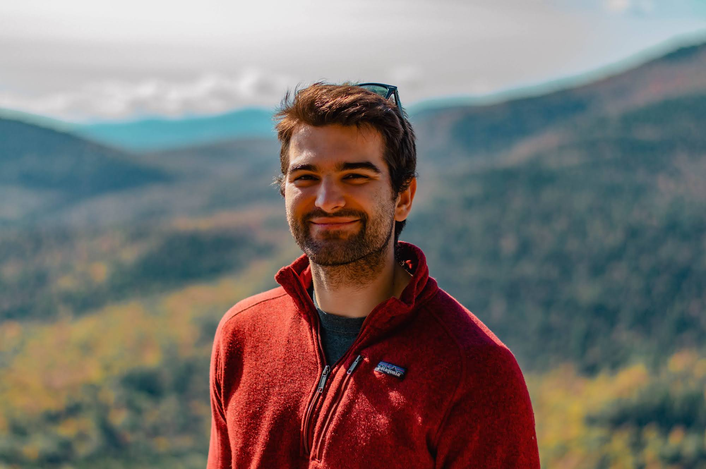

# Robert Colley

Hi! My name is Robert Colley and I'm a professional software engineer currently working at Hologic, Inc. in R&D. I am passionate about creating high-performance web applications that solve problems. Thus far, I have built my career on Health & Wellness technology and Medical Device technology.

## My Work

### Projects

Link: [Personal Projects](./projects.md)

### Genius Digital Diagnostics System - Connectivity & Image Management Server

Medical device for screening Cervical cancer from [ThinPrep® Pap Test](https://www.hologic.com/hologic-products/cytology/aptima-hpv-thinprep-cervical-health)

Link: [Genius Digital Diagnostics System](https://www.hologic.com/hologic-products/cytology/genius-digital-diagnostics-system)

### Jivista

Platform for tenants to find and rent properties

Link: [Jivista](https://jivista-io.vercel.app)

### AthElites.io

Mobile application for tracking workouts more accurately using speech-to-text.

Link: [AthElites.io](https://www.athelites.io)

### NextStep HealthTech

Link: [NextStep HealthTech](https://nextstep.world)

#### NextStep GoodLife

Social platform for youth ages 12-18 to engage with and share social wellness content. Sponsored by [NH Department of Education](https://www.education.nh.gov/) and [NYC Office of Community Mental Health](https://mentalhealth.cityofnewyork.us/wp-content/uploads/2022/01/MH_Report_v3.1_pages.pdf) to bring accessible mental health care resources to youth.

Link: [NextStep GoodLife](https://nextstepgoodife.com)

#### NextStep.Health

Multi-sided marketplace for connecting mental health care providers to clients.

Link: [NextStep.Health](https://nextstep.health)

#### NextStep Bloom

Social platform for youth ages 4-12 to engage with wellness content.

Link: [NextStep Bloom](https://nextstepbloom.com)

## Get in touch with Robert

My email is [robertjcolley@gmail.com](mailto:robertjcolley@gmail.com).
